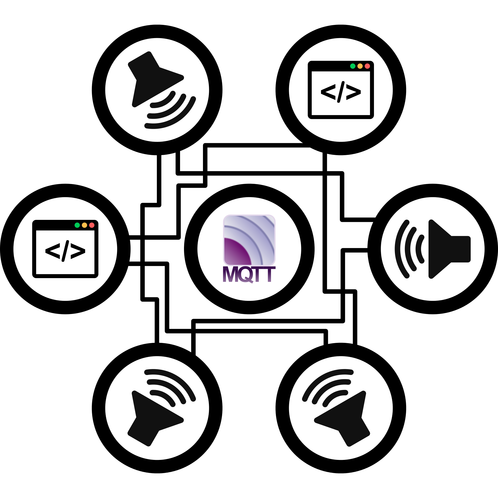

# Dynamic Network of Speakers 

This project holds a Dynamic Network of Speakers.

The goal for this project is to create a system where a user can setup speakers
and tell via a website what sound comes out of each speaker.
All the speakers are connected via the internet and are talking with each other
via a protocol called [MQTT](http://mqtt.org/).

This project can be described as a surround sound system.
There is support for objects that make sound and support for physical speakers that can play this sound.
Via a web interface, the speakers and objects can be drawn into an area.
If, for example, an object is closer to speaker A then to speaker B, then speaker A will produce more sound of said object in comparison with speaker B.  
In this project an object represents an Ogg music file.
A good example of a use case for this system is to use a [Multitrack song](https://en.wikipedia.org/wiki/Multitrack_recording) and use a multiple of speakers.
Then each part of this song(drums, bass, guitar, etc..), can be dragged to any speaker.
If this would be setup correctly you, the user, can walk between the speakers in real life and enjoy these sounds as if you were in the middle of it all.

## Folder structure

The folder structure used in this project and what to expect in each folder:

-   `./client/`: Contains the client source files.
-   `./config/`: Contains the config file that us used for configuration between website and client.
-   `./docs/`: In this folder resides the documentation of the project. See the [README](./docs/README.md) in that folder for further information.
-   `./misc/`: Some general files that are used in the project, like Logo's, font's, etc...
-   `./test/`: The tests for various library's in this system.
-   `./website/`: The website of this project.

## Installation / Compilation

To compile the various systems, this project uses a makefile.
The make commands can be issued from root directory of this project.
All the build executables are made in a 'build' folder.

Make commands available:

- `make` or `make dns_client`: Build the DNS client
- `make rwf_test`: Test of the RWF lib
- `make audio_test`: Test of the Audio lib
- `make download_test`: Test of the Download lib
- `make data_parser_test`: Test of the Data Parser lib
- `make logger_test`: Test of the Logger lib
- `make jzon_test`: Test of the JZON lib
- `make config_parser_test`: Test of the Config Parser lib
- `make clean`: Clean the build directory
- `make purge`: Delete the Build directory
- `make all`: Build all programs

### Dependencies
The client uses a couple of tools:
- libSFML-devel
- libMosquitto-devel

## Credits

All Authors - Listed Alphabetically.

-   [Ingmar Delsink](https://github.com/MrCrazyID)
-   [Menno van der Graaf](https://github.com/Mercotui)
-   [Brian van Zwam](https://github.com/Gerwie)

### Libraries

Libraries used in this project:

**Jzon**  

> Author  
> Copyright (c) 2015 Johannes Haggqvist
> Jzon is a JSON parser for C++ with focus on a nice and easy to use interface.
> <https://github.com/Zguy/Jzon>

**Eclipse Paho JavaScript client**  

> The Paho JavaScript Client is an MQTT browser-based client library written
> in Javascript that uses WebSockets to connect to an MQTT Broker.  
> <https://github.com/eclipse/paho.mqtt.javascript>

**jQuery**

> New Wave JavaScript  
> [jQuery is licensed](http://jquery.org/license) under [GNU GPL](http://www.gnu.org/licenses/gpl.html) and [MIT licences](http://www.opensource.org/licenses/mit-license.php), and with the MIT licence you could use it in commercial applications.

**marked**

> Author  
> Copyright (c) 2011-2014, Christopher Jeffrey. (MIT Licensed)  
> marked - a markdown parser  
> A full-featured markdown parser and compiler, written in JavaScript.
> Built for speed.  
> <https://github.com/chjj/marked>  

**Easylogging++**

> Author  
> Copyright (c) 2015 <http://muflihun.com> (MIT Licensed)  
> Easylogging++ is single header only, feature-rich, efficient logging library for C++ applications.   
> <https://github.com/easylogging/easyloggingpp>  

## Fonts

Fonts used in this project:

**Font Awesome**  

> Author  
> [Fort Awesome](https://fortawesome.github.io/Font-Awesome/)  
> The Font Awesome font is licensed under the SIL OFL 1.1:  
> <http://scripts.sil.org/OFL>  

**Xolonium**

> Author  
> Severin Meyer <mailto:sev.ch@web.de>  
> This Font Software is licensed under the SIL Open Font License,  
>  Version 1.1. This license is copied below, and is also available  
> with a FAQ at <http://scripts.sil.org/OFL>

**Nimbus Sans L**

> Author  
> [(URW)++](https://www.urwpp.de); Cyrillic glyphs added by Valek Filippov  
> LICENSE  
> [General Public License (GPL)](http://www.fsf.org/licenses/gpl.html)

## License

> You can check out the full license [here](./LICENSE)

This project is licensed under the terms of the **MIT** license.
